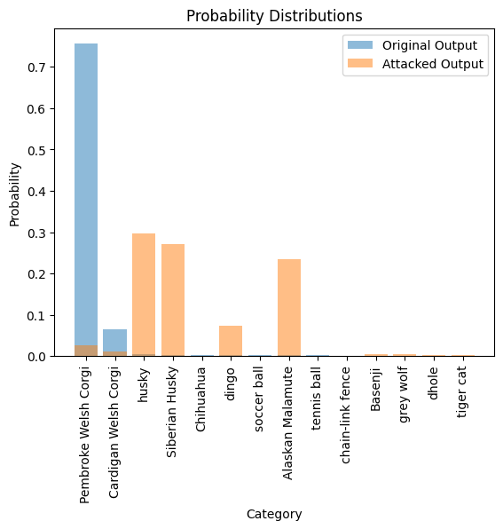

# ✨ FGSM Visualizer ✨
_FGSM Visualizer: visualize the FGSM attack_ 🚀
Links: https://klayand-ai-appliaction.streamlit.app/

### Author: Zikai Zhou

## Overview

Powered by Pytorch deep models and wrapped in a Streamlit interface, this app lets you understand how FGSM works.


## Getting Started

1. Clone the repository:

   ```bash
   git clone https://github.com/Klayand/ai-appliaction_platform.git
   ```

2. Navigate to the project directory:

   ```bash
   cd AI_applications
   ```

3. Install the dependencies:

   ```python
   pip install -r requirements.txt
   ```


## Usage

1. Run the Streamlit app:

   ```python
   streamlit run app.py
   or
   python main.py 
   ```

2. Navigate to the provided local URL, and voila! Start crafting your visual narratives.

## Contributions

Your insights can make this tool even better! Feel free to fork, make enhancements, and raise a PR.


   
   


